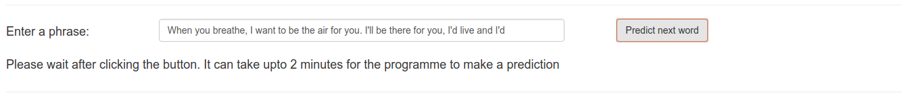
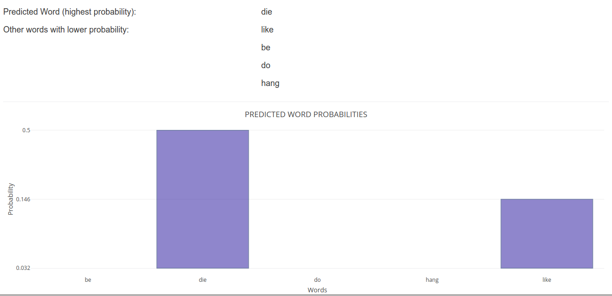

```{r setup, include=FALSE}
knitr::opts_chunk$set(echo = FALSE)
```

## Word prediction application.

The word prediction programme/app is presented as a single web page which can be accessed by 
visiting the following address:  
https://vwsingh.shinyapps.io/capstoneProject/  

After accepting the input, the app predicts the next possible word by computing the probability of all the words in it's dictionary
and returning the word with the highest probability.  

It also returns 4 other words in decreasing order of probability.  

The app was made after referring to the following text apart from the discussion 
forum of the capstone project.  
Jurafsky, Daniel & Martin, James H.(2009), _Speech and Natural Language Processing : An introduction to Natural Language Processing, Computational Linguistics and Speech Recognition Second Edition _, Pearson Education Inc. 


## The Input

The input is sent into the programme by the use of an input text field. The 
A phrase of more than one english word will be accepted as a valid input. 
An image of the input field is as below: 

```{r chunk1, out.width= "800px", echo=FALSE}
library(png)

```

It can take upto two minutes after pressing the submit button for the 
programme to display the result.  


## The Output

The output appears like the image below:  

```{r chunk2, out.width="600px", echo=FALSE}

```
  
## The mechanics
The programme accepts an input phrase and uses the last three words or 
last two words or the last(only) word in a markov method.  
Training data (blog, news articles & twitter messages) are used to make a dictionary and the programme then computes 
probabilities of words in this dictionary to make predictions.   
Training data is tokenized into terms (single words, 
bigrams, trigrams and quadgrams) using the quanteda package in R. Next the 
document frquency matrices (dfm's) are made (quanteda) and counts of 
seen terms calculated. Probabilities are calculated using these counts. 
The counts of terms (bigrams/trigrams/quadgrams) are discounted 
using simple-good-turing 
formula with katz adjustment in order to free up some probability for the 
unseen words in the dictionary.  
Probability of these unseen words are then calculated using the Katz-Backoff 
algorithm for bigrams/trigrams/quadgrams.  


